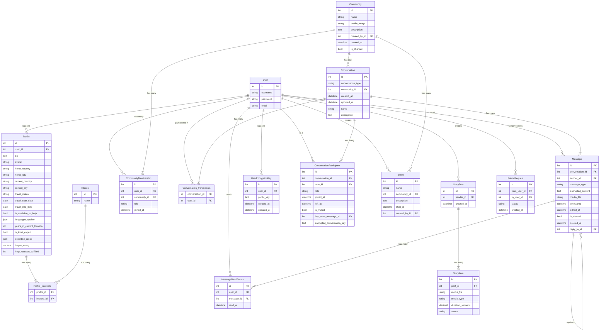

```mermaid
erDiagram
    User {
        int id PK
        string username
        string password
        string email
    }

    Profile {
        int id PK
        int user_id FK
        text bio
        string avatar
        string home_country
        string home_city
        string current_country
        string current_city
        string travel_status
        date travel_start_date
        date travel_end_date
        bool is_available_to_help
        json languages_spoken
        int years_in_current_location
        bool is_local_expert
        json expertise_areas
        decimal helper_rating
        int help_requests_fulfilled
    }

    Interest {
        int id PK
        string name
    }

    Profile_Interests {
        int profile_id FK
        int interest_id FK
    }

    Community {
        int id PK
        string name
        string profile_image
        text description
        int created_by_id FK
        datetime created_at
        bool is_channel
    }

    CommunityMembership {
        int id PK
        int user_id FK
        int community_id FK
        string role
        datetime joined_at
    }

    Conversation {
        int id PK
        string conversation_type
        int community_id FK
        datetime created_at
        datetime updated_at
        string name
        text description
    }

    Conversation_Participants {
        int conversation_id FK
        int user_id FK
    }

    Message {
        int id PK
        int conversation_id FK
        int sender_id FK
        string message_type
        text encrypted_content
        string media_file
        datetime timestamp
        datetime edited_at
        bool is_deleted
        datetime deleted_at
        int reply_to_id FK
    }

    MessageReadStatus {
        int id PK
        int user_id FK
        int message_id FK
        datetime read_at
    }

    UserEncryptionKey {
        int id PK
        int user_id FK
        text public_key
        datetime created_at
        datetime updated_at
    }

    ConversationParticipant {
        int id PK
        int conversation_id FK
        int user_id FK
        string role
        datetime joined_at
        datetime left_at
        bool is_muted
        int last_seen_message_id FK
        text encrypted_conversation_key
    }

    Event {
        int id PK
        string name
        int community_id FK
        text description
        datetime start_at
        int created_by_id FK
    }

    StoryPost {
        int id PK
        int sender_id FK
        datetime created_at
    }

    StoryItem {
        int id PK
        int post_id FK
        string media_file
        string media_type
        decimal duration_seconds
        string status
    }


    FriendRequest {
        int id PK
        int from_user_id FK
        int to_user_id FK
        string status
        datetime created_at
    }

    User ||--o{ Profile : "has one"
    User ||--o{ UserEncryptionKey : "has one"
    User ||--o{ CommunityMembership : "has many"
    User ||--o{ Conversation_Participants : "participates in"
    User ||--o{ Message : "sends"
    User ||--o{ MessageReadStatus : "reads"
    User ||--o{ ConversationParticipant : "is a"
    User ||--o{ Event : "creates"
    User ||--o{ StoryPost : "creates"
    User ||--o{ FriendRequest : "sends/receives"


    Profile ||--|{ Profile_Interests : "has many"
    Interest ||--|{ Profile_Interests : "is in many"

    Community ||--|{ CommunityMembership : "has many"
    Community ||--o{ Conversation : "has one"
    Community ||--o{ Event : "has many"

    Conversation ||--|{ Conversation_Participants : "has many"
    Conversation ||--|{ Message : "has many"
    Conversation ||--|{ ConversationParticipant : "has many"

    Message ||--o{ MessageReadStatus : "has many"
    Message ||--o{ Message : "replies to"

    StoryPost ||--|{ StoryItem : "has many"

```
